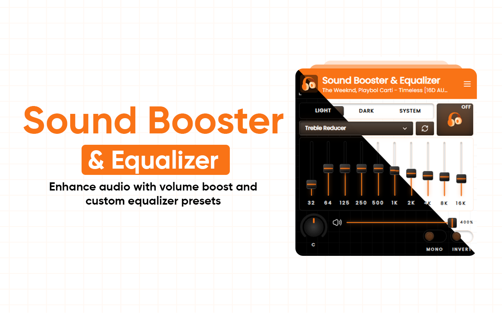

# Sound Booster & Equalizer - Global Settings Update

## ✅ Changes Made

### Removed Per-Tab Logic

- ❌ Removed `enabledTabs` tracking
- ❌ Removed `globalEnabled` flag
- ❌ Removed "STOP ALL" button
- ❌ Removed per-tab status display
- ❌ Removed `stopAllTabs` message



### Simplified to Global Settings

- ✅ Single `enabled` toggle affects all tabs
- ✅ All tabs receive the same settings
- ✅ Settings apply globally when enabled
- ✅ Status shows "ACTIVE ON ALL TABS"

## 🎯 Current Behavior

### Toggle Switch

- **Location**: Top-right of popup
- **Function**: Enable/disable extension on ALL tabs
- **When Enabled**: Settings broadcast to all open tabs
- **When Disabled**: Audio processing stops on all tabs

### Settings Propagation

All settings apply globally to every tab:

- ✅ Equalizer bands
- ✅ Volume boost
- ✅ Stereo/Mono mode
- ✅ Phase inversion
- ✅ Balance (pan)
- ✅ Selected preset

### Real-time Updates

When you adjust any control:

1. Setting is saved to storage
2. Update is broadcast to all tabs
3. All tabs apply the new setting instantly

## 📊 Updated Data Structure

### AudioSettings Interface

```typescript
{
  enabled: boolean;              // Global on/off
  currentPreset: string;         // Current preset ID
  presets: AudioPreset[];        // All presets
  stereoMode: 'stereo' | 'mono'; // Stereo/Mono mode
  invertPhase: boolean;          // Phase inversion
  balance: number;               // Pan (-1 to 1)
}
```

### Storage Example

```json
{
  "audioSettings": {
    "enabled": true,
    "currentPreset": "bass-boost",
    "presets": [...],
    "stereoMode": "stereo",
    "invertPhase": false,
    "balance": 0
  }
}
```

## 🎨 UI Changes

### Before (Per-Tab)

```
┌─────────────────────────────────────┐
│  AUDIO EQ              [TOGGLE]     │
├─────────────────────────────────────┤
│  ● ACTIVE ON THIS TAB              │
│  Active on 3 tabs    [STOP ALL]   │
└─────────────────────────────────────┘
```

### After (Global)

```
┌─────────────────────────────────────┐
│  AUDIO EQ              [TOGGLE]     │
├─────────────────────────────────────┤
│  ● ACTIVE ON ALL TABS              │
└─────────────────────────────────────┘
```

## 🔧 Implementation Details

### App.tsx Changes

- Removed `currentTabId` state
- Removed `isCurrentTabEnabled` state
- Removed `enabledTabCount` calculation
- Removed `getCurrentTab()` function
- Removed `toggleCurrentTab()` function
- Removed `stopAllTabs()` function
- Simplified to `toggleEnabled()` affecting all tabs

### Message Broadcasting

```typescript
const applyToAllTabs = async (data) => {
  const tabs = await browser.tabs.query({});

  for (const tab of tabs) {
    if (tab.id) {
      await sendMessage('applySettings', data, tab.id);
    }
  }
};
```

### Content Script

- Listens for `applySettings` message
- Applies settings when `enabled: true`
- Disconnects audio when `enabled: false`
- No per-tab logic needed

## 🎯 User Experience

### Enabling the Extension

1. Click toggle switch
2. Extension activates on ALL tabs
3. Status shows "ACTIVE ON ALL TABS"
4. All current and future tabs use the same settings

### Adjusting Settings

1. Change any control (EQ, volume, balance, etc.)
2. Setting saves automatically
3. All tabs update in real-time
4. No need to re-enable or switch tabs

### Disabling the Extension

1. Click toggle switch
2. Audio processing stops on ALL tabs
3. Status indicator disappears
4. Settings are preserved for next time

## 🚀 Benefits of Global Settings

### Simplicity

- ✅ One toggle controls everything
- ✅ No confusion about which tabs are active
- ✅ Easier mental model for users

### Consistency

- ✅ Same audio experience across all tabs
- ✅ No need to remember different settings per site
- ✅ Predictable behavior

### Performance

- ✅ Simpler state management
- ✅ Less storage overhead
- ✅ Fewer message passes

### Use Cases

- **Music Streaming**: Apply bass boost to all music tabs
- **Video Watching**: Cinema mode across Netflix, YouTube, etc.
- **Podcasts**: Voice enhancement on all podcast sites
- **Gaming**: Consistent audio across multiple game tabs

## 💡 Quick Reference

| Action             | Result                            |
| ------------------ | --------------------------------- |
| Toggle ON          | Extension activates on all tabs   |
| Toggle OFF         | Extension deactivates on all tabs |
| Change preset      | All tabs update to new preset     |
| Adjust EQ          | All tabs get new EQ settings      |
| Change balance     | Pan applies to all tabs           |
| Toggle stereo/mono | Mode changes on all tabs          |
| Invert phase       | Phase flips on all tabs           |

## 🔄 Migration from Previous Version

If updating from the per-tab version:

- Old `enabledTabs` data is ignored
- Extension starts in disabled state
- User enables once for all tabs
- All previous presets preserved
- No data loss

## ✨ Summary

The extension now operates with a **simple global on/off switch**:

- ⚡ **Faster**: No per-tab tracking overhead
- 🎯 **Clearer**: One state for all tabs
- 💪 **Powerful**: Same great audio features
- 🎨 **Cleaner**: Simplified UI

Perfect for users who want consistent audio enhancement across all their browsing!
